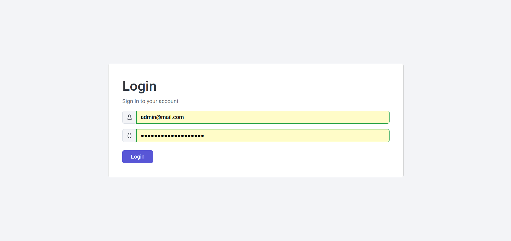
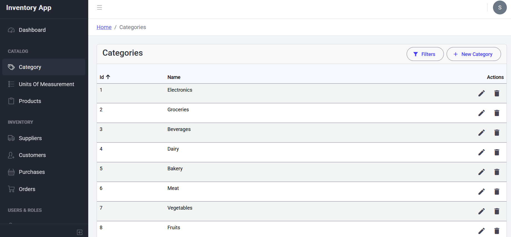
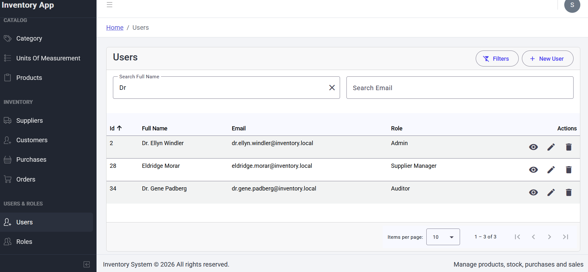
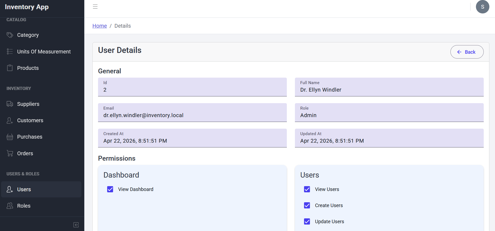
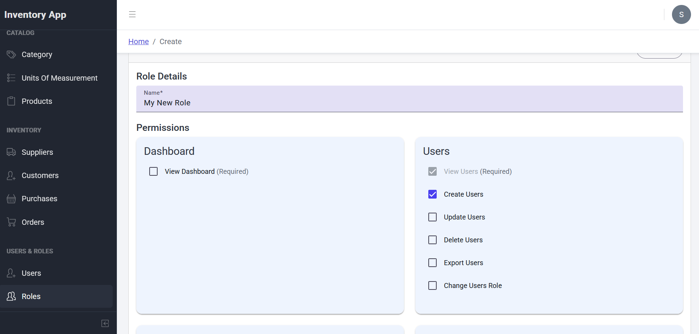
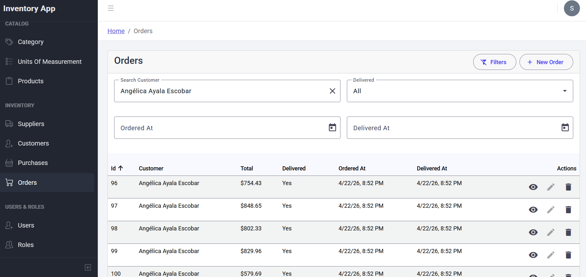
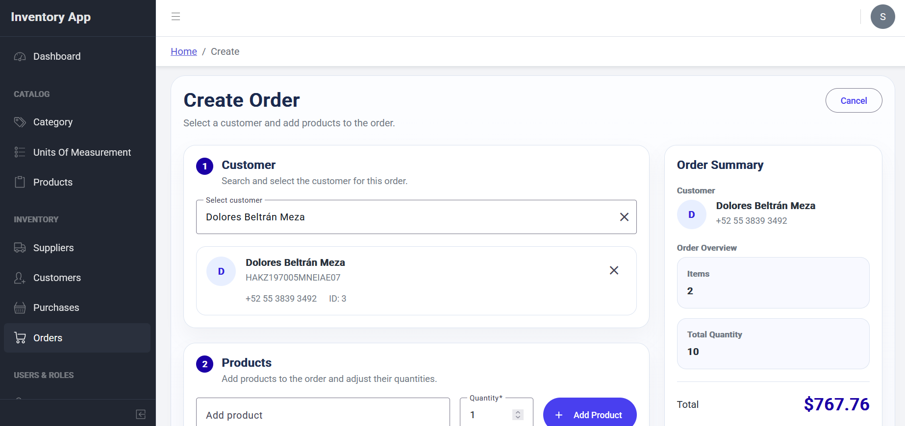
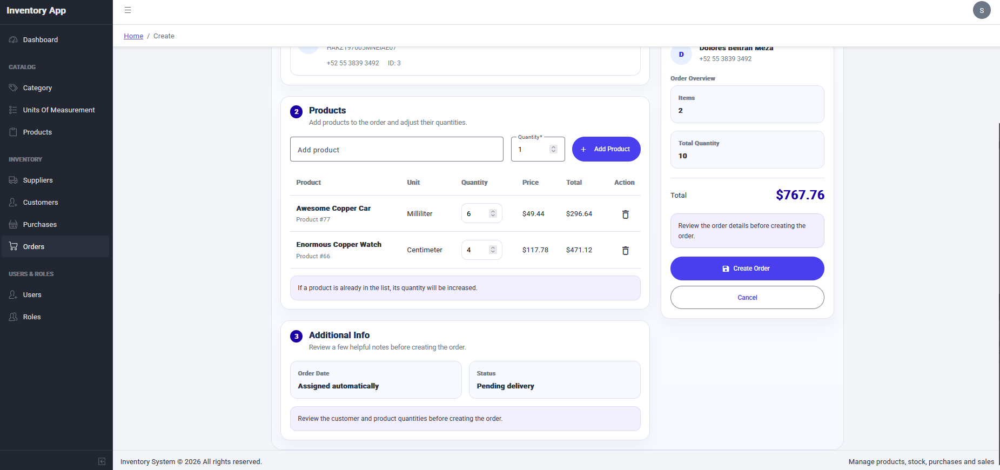

# Inventory Angular

Inventory Angular is a modern inventory management frontend built with Angular 19, CoreUI, Angular Material, and NgRx. It provides an admin dashboard experience for managing catalog, inventory, sales, and access control workflows through a responsive UI with JWT authentication and permission-based authorization. 

* * *

## Features

* JWT-based authentication
* Permission-based authorization
* Lazy-loaded feature modules
* Reactive forms for create and edit flows
* NgRx-powered state management with facades
* Pagination, sorting, filtering, and detail views across core modules
* Real time updates via WebSockets.

* * *

## Tech Stack

### Libraries

* Angular 19
* TypeScript
* CoreUI
* Angular Material
* NgRx
* RxJS
* Auth0 Angular JWT

### Architecture and Patterns

* Standalone components
* Lazy-loaded routes
* Feature-based folder structure
* Auth and permission guards
* Facade pattern for state access

* * *

* * *

## Project Structure

```text
src
|-- app
|   |-- core          # auth, permissions, interceptors, guards, app store
|   |-- features      # dashboard, auth, categories, units, products, suppliers,
|   |                 # customers, purchases, orders, users, roles
|   |-- layout        # default layout, navigation, header, footer
|   `-- shared        # shared types, utils, autocomplete, icons
|-- assets
|-- environments
`-- scss
```

* * *

## Running the Project

### Prerequisites

* Node.js `^18.19.1`, `^20.11.1`, or `^22.0.0`
* npm `>= 9`

### Installation

```bash
npm install
```

### Development

The development environment currently points to this API base URL:

```ts
baseUrl: 'http://localhost:8080/api'
```

You can update it in:

`src/environments/environment.development.ts`

Then run:

```bash
npm start
```

The app runs at:

`http://localhost:4200`

### Production Build

```bash
npm run build
```

* * *

## Screenshots

### Application Preview











* * *

## Roadmap

### Next Steps

* Create Unit Tests
* Continue polishing UX consistency across CRUD screens

* * *

## Available Scripts

* `npm start` - run the development server
* `npm run build` - create a production build
* `npm test` - run unit tests

* * *
